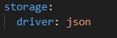

# Mini-CRM CLI 

## Installation 
Telecharger les packages avec
 ```go mod tidy``` 

## Definir le type de stockage 
Dans le fichier config.yaml vous pouvez choisir ces 3 modes de stockage : 
- gorm : Utilse une base de données SQLite


- json : Crée ou modifie un fichier de contacts en JSON 


- memory : Print la sortie sur la console 


## Compilation et lancement du projet 

Le projet est compilé dans le dossier /bin. En cas de modifiaction, vous pouvez le recompiler avec la commande 

```go
go build -o bin/contact-manager.exe
```

## Commandes


* Ajouter un utilisateur : 

 ```bash
 .\bin\contact-manager.exe add  -e mail@mail.com -n name 
```
Utilisez les flags -n pour définir le nom et -e pour définir l'email


* Obtenir la liste des utilisateurs  
 ```bash
.\bin\contact-manager.exe getall
```

* Obtenir un utilisateur 

```bash
.\bin\contact-manager.exe getbyid  -i 1
```
Utilisez le flag -i pour entrer l'ID de l'utilisateur 

* Modifier un utilisateur 
```
 .\bin\contact-manager.exe update -i 2 -n NewName -e new@mail.com
```
Utilisez le flag -i pour entrer l'ID de l'utilisateur \
Utilisez les flags -n pour définir le nom et -e pour définir l'email

* Supprimer un utilisateur 
```bash 
.\bin\contact-manager.exe delete -i 2
```
Utilisez le flag -i pour entrer l'ID de l'utilisateur 

Enjoy ! 